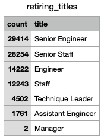
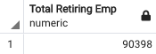
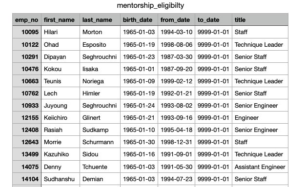

# Pewlett Hackard Analysis

## Overview
At Pewlett Hackard, the company is preparing for the impending retirement of their employees that are aging out of the workforce. Our goal is to deterimine the number of employees that are retiring that hold a particular title to best prepare for their departure and the void that will be created. Next we want to determine the employees who are not yet retiring but may be soon who would be eligible to take on a mentorship role to train the next generation. After parsing through our data we will analyze our results so Pewlett Hackard can be prepared to handle the "silver tsunami" that is gearing up to happen as employees begin to retire.

## Resources
- Files: Pewlett Hackard CSVs
- Software: SQL, pgAdmin 4, PostgreSQL

## Results
The following are four results found during the analysis of the data provided by Pewlett Hackard:

1. A jarring number of employees are becoming eligible to retire in the very near future. Of these employees, the majority of them will be senior members of Pewlett Hackard -- 29,414 senior engineers and 28254 senior staff members -- making nearly 60,000 senior positions vacant. These positions are typically harder to fill because of the experience and training required.

2. Any mentorship program provided will need to be able to accomodate training and/or transitioning employees into the 90,398 vacant positions, as seen as the sum of the above table.

3. For employees that would be eligible to become mentors, many of them are also in senior or leadership positions (seen below).

4. However, if we were to count the total rows in our mentorship_eligibilty table we see that there are only 1549 "eligible mentors," a much smaller total number (even though this is only one birth year's worth of employees) than what we saw with three birth year's worth of employees retiring.

    

## Summary
### The Silver Tsunami and The Question of Mentorship
Pewlett Hackard will be seeing in the coming months and years 90,398 employees retire from their workforce creating a vacancy of positions that will need to be filled as quickly as possible. According to our analysis, there is almost 1/9th the amount of qualified, retirement-ready employees who would be able to mentor the next generation of Pewlett Hackard employees -- this is simply, not enough. To take these eligible employees out of the workforce, in addition to the roughly 60,000 senior employees retiring, and the 90,398 total retiring, could cause siginificant strain on the company by losing such valuable and knowledgable talent. In planning ahead we would benefit from slightly expanding the mentorship eligibility criteria to a younger age threshold. We are currently only pulling from one birth year worth of employees while also assuming that folks born within a three year period will all begin to retire now. Perhaps by matching three years of eligible retirees to three years of eligible mentors we would see enough mentors to make the program beneficial to help prepare the next generation.

### Additional Analysis
- **Departments in Disarray:** It is important to see the strain that each retiree's departure could have on the total number of employees per that deptartment. To aid us visually, we could create a table that pulls together the total count of employees per department before and after the retirees depart. This would give us a better idea of where to focus hiring efforts. For example, if the 29,414 senior engineers leaving does not make as significant of a decrease in workforce as the 4502 technique leaders does, then we know to focus hiring efforts on technique leaders.
- **Employee Turnover:** Another helpful table to see would be employee turnover. It would be helpful to know how long folks stay with Pewlett Hackard because if there is significant turnover for specific departments then that could be a point to address during the mentorship program. It could begin to answer the quesiton: how do we get our employees to feel a desire to stay and grow with the company? (Perhaps the mentorship program is a great first step in this direction anyway!) We could also make an additional table to see how much internal growth there is in the company -- how many employees get internally promoted? Both of these tables would be helpful in seeing what positions may open up in the future aside from those that are retiring which could further help us plan ahead.